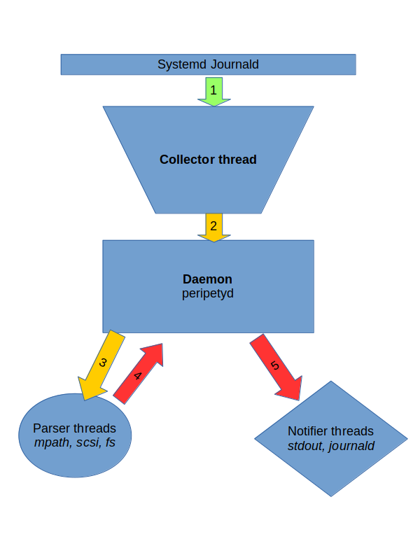

<!-- vim-markdown-toc GFM -->

* [Storage Event Notification Daemon](#storage-event-notification-daemon)
    * [Why another daemon?](#why-another-daemon)
        * [Why not expand udisks for this?](#why-not-expand-udisks-for-this)
        * [Why this tool is better?](#why-this-tool-is-better)
    * [How-to](#how-to)
    * [Event format](#event-format)
    * [Thread types](#thread-types)
    * [Workflow](#workflow)
    * [Daemon Configuration (TODO)](#daemon-configuration-todo)

<!-- vim-markdown-toc -->

# Storage Event Notification Daemon

## Why another daemon?

### Why not expand udisks for this?

 * Current design of udisks require modules written in C which is not a good
   language for string manipulation which is quit common when parsing eventing.

 * Udisks components are trigger by uevent which only have add/change/del
   event type defined, modules need to extra work to find out what just
   happened. Yes, we can change udisks to support event types, but IMHO, that
   require much more work than creating new storage event daemon in rust.

### Why this tool is better?

 * Rust is memory-leak-proof and quite easy to handle threading, IPC and string
   manipulation.

 * Only do one thing quick and simple -- provide storage events.

## How-to

```bash
make
make run

# Then open another terminal to generate some storage errors
make test
```

## Event format
```json
{
    "hostname":             "gris-laptop.example.com",
    "severity":             "info|warn|error",
    "system":               "scsi|lvm|multipath|block|fs|mdraid",
    "timestamp":            1522130579,
    "event_id":             "uuid_of_event",
    "root_cause_event_id":  "uudi_of_event_of_root_cause",
    "event_type":           "string_like DM_MPATH_PATH_DOWN",
    "dev_wwid":             "wwid_of_device_related",
    "dev_name":             "device_name",
    "dev_path":             "device_path in /dev/ folder",
    "owners_wwids":         ["wwids of owner devices"],
    "owners_names":         ["names of owner devices"],
    "owners_paths":         ["paths of owner devices"],
    "msg":                  "human_readable_message",
    "extentions":           {
        "plugin_specifc_1":     "value_1",
        "plugin_specifc_2":     "value_2",
        "plugin_specifc_3":     "value_3"
    }
}
```

## Thread types
* **Collector**

  Collects raw events from journald.
  For a raw event, `dev_wwid` might be missing and `dev_name` might not
  be human friendly (for example, a SCSI disk event might have `dev_name`
  "4:0:0:1").
  TODO: Allows use to extend regex used for parsing journals.

* **Parser**

  Parses both raw and synthetic events then generates synthetic events for
  collectors.
  For the generated synthetic events the parser must provide a valid and
  consistent `dev_wwid` and human-friendly `dev_name` value.
  Restricts the events it parses to an appropriate subset using a filter.

  Examples: `mpath`, `scsi`, `fs`, and `dm` thread.

* **Notifier**

  Listens to all events, and generates appropriate actions.

  Examples: `stdout`, `journald`, `email`, `irc`, etc.

## Workflow



0. The daemon starts all threads.
1. The `collector` thread collects an event from journald.
2. The `collector` thread parse the event and sends the raw event to the daemon.
3. The daemon sends the event to selected parser threads based on their filter
   settings.
4. The selected parser plugins process the event and each sends a synthetic
   event back to the daemon.
5. The daemon broadcasts all synthetic events to notifier threads.

## Daemon Configuration (TODO)

The configuration file will be `/etc/peripetyd.conf`, example:

```toml
[main]

[[collector_regexs]]
# This regex is already build-in.
starts_with = "device-mapper: multipath:"
regex = '''(?x)
        ^device-mapper:\s
        multipath:\ Failing\ path\s
        (?P<kdev>\d+:\d+).$
'''
# `kdev` naming capture group is mandatory.
# `sub_system` naming capture group is optional.
sub_system = "multipath"
event_type = "DM_MPATH_PATH_FAILED"
```
